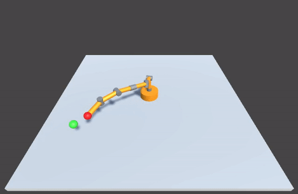

# N-Axis Robotic Arm Control

## Introduction

This project aims to control a robot arm with an arbitrary number of joints using genetic algorithms.
Today it is possible to change the number of joints and the accuracy of movement.

## The evolution

A new population of 10 individuals is created each generation. The individual has a gene with the rotation for each joint. To decide which individual will be chosen to move the arm, the distance between the arm end and the goal is calculated and the individual who minimizes this distance is selected. After selecting the individual, new individuals are generated from this previous winner.

## Results
Today, the arm can go from the current position to the desired position with any number of joints, but no collisions are being considered, resulting in impossible movements.

## How to test
This project was made using Unity Engine. To run the simulations and edit this program, **install the Unity 2018.3**. After improving the user interface, I will generate executable files to make this project more accessible.

## Future work
- Avoid obstacles
- Calculate current position with joint angles
- User interface to move the ball and change arm parameters
- Web application
